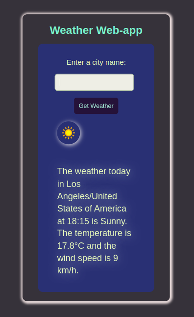
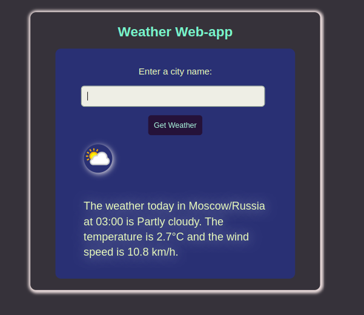
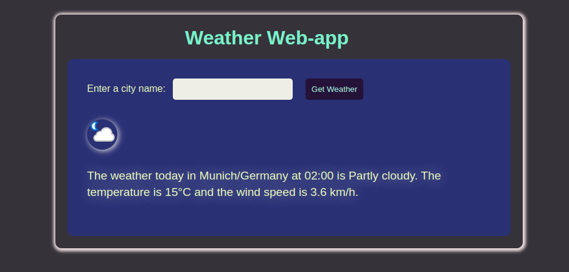

# Weather-web-app

- `JavaScript` 
- `HTML`
- `CSS`
## Use the weather API to create a weather web-app that gets the weather based on a city name.
### [APP-Link](https://salimov333.github.io/weather-web-app/)
--- 




---
### Resources:
#### [weather api](https://www.weatherapi.com/)
#### [axios documentation](https://www.npmjs.com/package/axios)
---
### Install:
```bash
npm i
```
### Run:
> run index.html using live-server
---
### Starter cmd:
```bash
npm init -y
echo "node_modules/" > .gitignore
echo "dist/" >> .gitignore
npm i axios
npm i gh-pages -D
mkdir src src/styles src/scripts src/images
touch src/index.html src/scripts/index.js src/styles/style.css 
```

### Constructor:
#### package.json
```JSON
"script":{
    "build": "rm dist -rf && mkdir dist && cp -r src/* dist",
    "publish": "gh-pages -d dist",
    "deploy": "npm run build & npm run publish"
}
```
#### deploy
```bash
npm run deploy
```